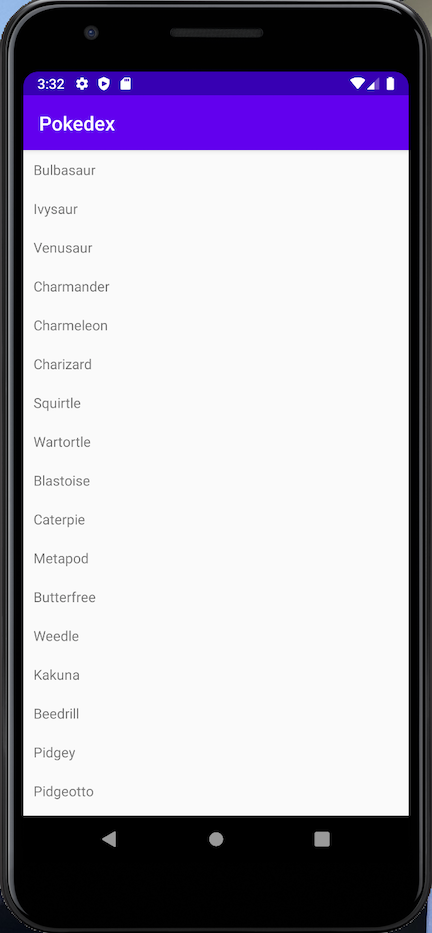
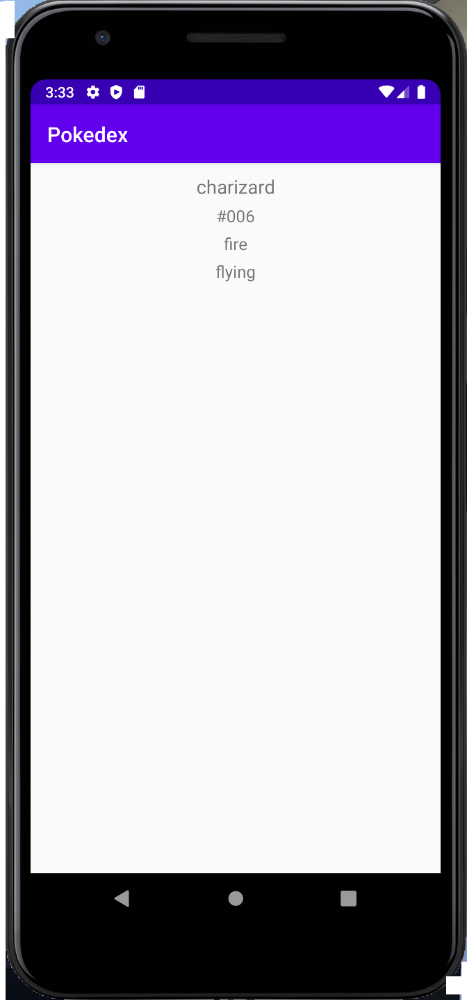

# Android-Pokedex
One of the many web development projects offered by HarvardX's CS50: Introduction to Computer Science course.

This Mobile App Development project uses Java and Android Studio to create a simplified version of a "Pokedex", a renowned tool used in the popular television show and video game series, titled "Pokemon". 

Personally, this was my very first Android app, as well as my very first attempt at coding with Java. I've still got a lot to learn about programming with Java and Android app development, but I am still proud at accomplishing another programming stride. 

Preview #1:

 

------------------------------------------------------------------------------------------------------------------------------------------------

Preview #2:

